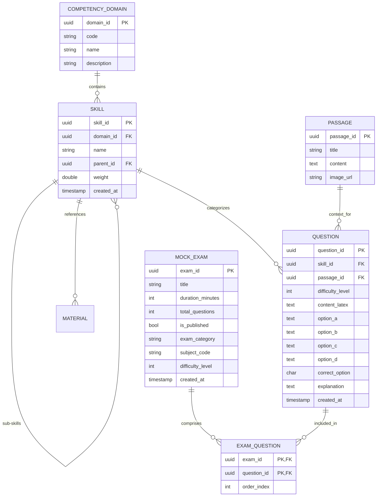
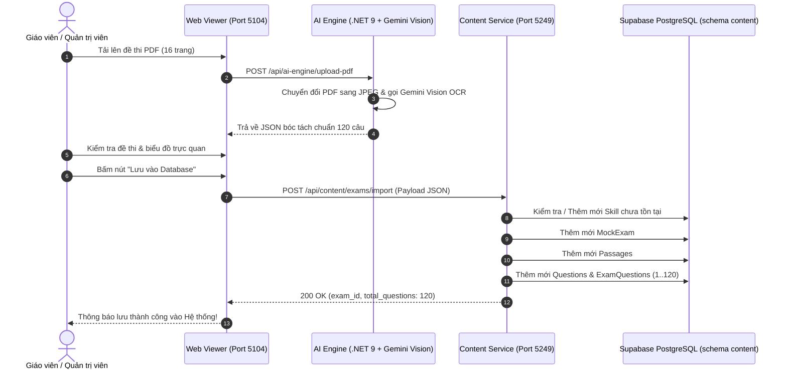

# Kiến trúc Hệ thống & Cơ sở Dữ liệu (Content Service Architecture)

Tài liệu này trình bày chi tiết kiến trúc tổng thể, mô hình thực thể dữ liệu (ERD), nguyên lý Clean Architecture + CQRS và các giao thức tích hợp của phân hệ **V-Eval-Content_Service**.

---

## 1. Tổng quan Kiến trúc (Architectural Overview)

Phân hệ **Content Service** đóng vai trò là kho lưu trữ và cung cấp nội dung học thuật cho toàn bộ hệ sinh thái **V-Eval**, bao gồm:
* **Ngân hàng đề thi thử (Mock Exams)**: Đề thi chuẩn ĐGNL ĐHQG-HCM (V-ACT) 120 câu hoặc đề luyện tập theo chuyên đề/môn học.
* **Ngân hàng câu hỏi (Question Bank)**: Lưu trữ các câu hỏi trắc nghiệm kèm 4 lựa chọn (A, B, C, D), đáp án chuẩn, lời giải chi tiết và công thức Toán/Lý/Hóa dưới định dạng chuẩn LaTeX (`$...$`, `$$...$$`).
* **Chùm bài đọc hiểu (Passages)**: Các ngữ cảnh bài đọc tiếng Việt/tiếng Anh, biểu đồ dữ liệu kinh tế/xã hội dùng chung cho 3-5 câu hỏi liên tiếp.
* **Cấu trúc cây kỹ năng (Skills Hierarchy)**: Phân cấp kỹ năng theo từng lĩnh vực năng lực (Toán học, Tư duy logic, Ngôn ngữ, Khoa học tự nhiên, Khoa học xã hội).
* **Tài liệu học tập (Materials)**: Các bài giảng tóm tắt lý thuyết hỗ trợ luồng RAG của AI Engine.

### 1.1. Bốn tầng Clean Architecture (.NET 9)

```
┌────────────────────────────────────────────────────────┐
│              V-Eval-Content_Service.API                │
│ (Minimal APIs, Endpoints, Middleware, Swagger, CORS)   │
└──────────────────────────┬─────────────────────────────┘
                           │ references
┌──────────────────────────▼─────────────────────────────┐
│          V-Eval-Content_Service.Application            │
│  (CQRS MediatR Commands/Queries, DTOs, Business Rules) │
└──────────────────────────┬─────────────────────────────┘
              ▲            │ references
   references │ ┌──────────▼─────────────────────────────┐
              │ │          V-Eval-Content_Service.Domain │
              │ │ (Core Entities, Value Objects, Enums)  │
              │ └──────────────────▲─────────────────────┘
┌─────────────┴────────────┐       │ references
│  ...Infrastructure       ├───────┘
│ (EF Core, DbContext,     │
│  Npgsql Supabase, Repo)  │
└──────────────────────────┘
```

1. **`Domain` Layer**:
   * Chứa các thực thể trung tâm: `MockExam`, `Question`, `Passage`, `Skill`, `CompetencyDomain`, `ExamQuestion`, `Material`.
   * Hoàn toàn độc lập, không phụ thuộc vào bất kỳ thư viện bên ngoài nào ngoại trừ các kiểu dữ liệu chuẩn C#.
2. **`Application` Layer**:
   * Triển khai mẫu hình **CQRS (Command Query Responsibility Segregation)** qua thư viện `MediatR`.
   * Tách biệt rõ ràng luồng ghi (`Commands`) như `CreateMockExamCommand`, `DeleteMockExamCommand` và luồng đọc (`Queries`) như `GetMockExamsQuery`, `GetMockExamByIdQuery`.
3. **`Infrastructure` Layer**:
   * Chịu trách nhiệm tương tác với thế giới bên ngoài: PostgreSQL trên nền tảng Supabase Cloud.
   * `ContentDbContext` kế thừa từ EF Core `DbContext`, cấu hình bảng ánh xạ trực tiếp vào schema `content`.
4. **`API` Layer**:
   * Sử dụng **ASP.NET Core Minimal APIs** gọn nhẹ, hiệu năng cao, thời gian khởi động nhanh.
   * Cấu hình CORS mở cho các cổng dev frontend (`http://localhost:5104`, web clients).

---

## 2. Mô hình Cơ sở Dữ liệu & Thực thể (Database Schema & ERD)

Dữ liệu được lưu trữ trên **PostgreSQL (Supabase)**, gom nhóm trong schema chuyên biệt mang tên `content`.

### 2.1. Sơ đồ Quan hệ Thực thể (Mermaid ERD)



### 2.2. Chi tiết các Bảng Dữ liệu

| Tên Bảng (Schema `content`) | Thực thể C# | Mô tả Chức năng |
| :--- | :--- | :--- |
| `mock_exams` | `MockExam` | Lưu thông tin đề thi tổng quát (Tiêu đề, thời gian làm bài, số lượng câu, danh mục). |
| `questions` | `Question` | Ngân hàng câu hỏi trắc nghiệm kèm 4 lựa chọn, đáp án, giải thích và công thức LaTeX. |
| `passages` | `Passage` | Đoạn văn hoặc bối cảnh phân tích dùng chung cho nhiều câu hỏi đọc hiểu / đồ thị. |
| `exam_questions` | `ExamQuestion` | Bảng liên kết nhiều-nhiều (N-N) giữa đề thi và câu hỏi, duy trì thứ tự xuất hiện (`order_index` từ 1 đến 120). |
| `skills` | `Skill` | Cây phân cấp kỹ năng học tập, hỗ trợ tính năng tự động tạo mới nếu AI đề xuất kỹ năng mới. |
| `competency_domains` | `CompetencyDomain` | Lĩnh vực năng lực chuẩn của bài thi ĐGNL V-ACT (Toán học, Tiếng Việt, Tiếng Anh, Logic, Khoa học). |
| `materials` | `Material` | Tài liệu học thuật tóm tắt kiến thức cốt lõi. |

---

## 3. Quy trình Tích hợp Liên thông với AI Engine



### Điểm nổi bật trong xử lý dữ liệu:
1. **Dynamic Skill Auto-Creation**:
   * Khi AI trích xuất câu hỏi kèm `suggestedSkillName`, Content Service tự động kiểm tra xem kỹ năng đó đã có trong cơ sở dữ liệu hay chưa.
   * Nếu chưa có, hệ thống tự động gán vào Domain phù hợp (`MATH`, `LOGIC`, `VIET`, v.v.) và lưu vào bảng `skills` để tái sử dụng, giúp giảm thiểu thao tác nhập liệu thủ công của giáo viên.
2. **Bảo toàn Tuyệt đối Công thức LaTeX**:
   * Mọi ký hiệu toán học như ma trận, tích phân, căn bậc hai, phân số đều được lưu giữ nguyên trạng (`$f(x) = \int_0^1 ...$`) trong trường `content_latex` và các trường `option_a`, `option_b`, `option_c`, `option_d`.
3. **Toàn vẹn Giao dịch (Transaction Integrity)**:
   * Toàn bộ 120 câu hỏi và các chùm bài đọc được lưu trong một `DbContext.SaveChangesAsync()` duy nhất. Nếu có bất kỳ lỗi nào xảy ra, dữ liệu sẽ tự động rollback mà không để lại dữ liệu rác.

---

## 4. Bảo mật & Quy chuẩn Triển khai

1. **Bảo vệ Secret & Chuỗi kết nối Database**:
   * Chuỗi kết nối `SupabaseConnection` tuyệt đối **không** được lưu cứng trong mã nguồn hoặc tệp `appsettings.json` bị push lên GitHub.
   * Tất cả thông tin nhạy cảm được đặt trong `appsettings.Development.json` (được cấu hình trong `.gitignore`) hoặc biến môi trường `ConnectionStrings__SupabaseConnection`.
2. **Cấu hình CORS an toàn**:
   * Cho phép các origin tin cậy kết nối đến API: `http://localhost:5104` (AI Engine Web Viewer), `http://localhost:3000` (Next.js Web Client), `http://localhost:5173` (Vite Client).
3. **Cơ chế Xóa An toàn (Cascade Deletion)**:
   * Khi thực hiện lệnh `DELETE /api/content/exams/{id}`, Content Service kiểm tra và xóa toàn bộ các quan hệ phụ thuộc liên đới trong `exam_questions` và `questions` nhằm tránh lỗi vi phạm khóa ngoại (Foreign Key Constraint).
